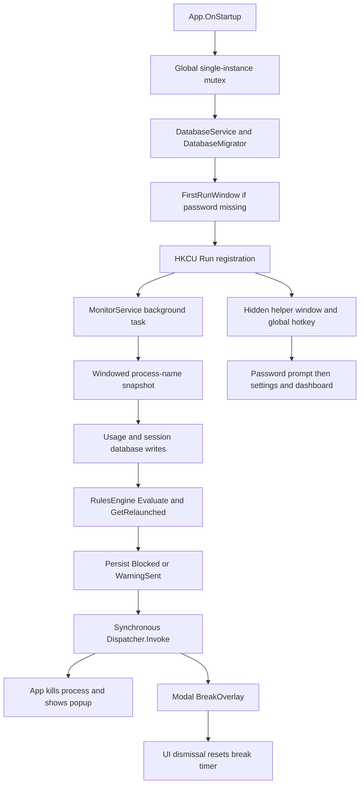

# ScreenTime architecture and implementation plan

Architecture review dated 2026-09-23, against commit `6bc3bfe6698b21ccbc8b2b3c3e7e46aae134e8b7`.

This is a design document, not an implementation. The only source-controlled change in this task is this file. No application code, tests, database, startup registration, project names, or namespaces have been changed. Proposed new files below do not exist yet.

**Recommendation:** incrementally evolve TimeGuard. Keep the .NET/WPF application, Core/App boundary, SQLite/Dapper storage, weekly allowance editor, and password hashing; retain the history dashboard for optional reuse without making its redesign an MVP requirement. Replace the meaning of persistent blocking, separate enforcement from WPF, and make monitoring lifecycle and time accounting explicit. A rewrite or privileged service is unnecessary.

Priority order: correct enforcement; gaming performance and non-interference; reliability; minimal footprint; testability; UX polish. The design remains local-only, offline-capable, user-mode, and per-user. It introduces no driver, injection, graphics hook, game-memory inspection, anti-cheat integration, network filtering, browser extension, cloud account, telemetry, or permanent Windows service.

The user's accepted baseline is a successful build, zero errors, one existing CS0618 warning for `Model.MouseDown` in `DashboardWindow.xaml.cs`, 37 passing unit tests, and 18 passing UI tests. During the initial architecture review, `dotnet build TimeGuard.sln --no-restore --nologo` succeeded with zero errors and no warning re-emitted by the incremental build; this does **not** mean the existing warning was fixed. The 16 `RulesEngineTests` also passed using `dotnet test tests/TimeGuard.Tests/TimeGuard.Tests.csproj --no-build --no-restore --filter FullyQualifiedName~RulesEngineTests --nologo`. The database and UI suites were inspected but not rerun: their current isolation has filesystem, process, and registry gaps described below. The supplied 37/18 results remain the full baseline, not a newly claimed full-suite run.

## MVP boundary — first usable release

This boundary governs every proposal, file list, schema, test, and phase below. The MVP primarily serves **one selected game/application, such as Apex Legends**. Keep application-keyed rules, usage, and grace so the architecture can support multiple applications later; multi-app coordination or elaborate selection UI is not a prerequisite for the first usable release.

### MVP requirements

- Per-app weekday daily allowance: initially Monday–Thursday 60 minutes, Friday 90, Saturday–Sunday 120.
- Explicit blocked/downtime periods, including crossing midnight and overnight anti-binge downtime, independent of daily usage accounting.
- One persistent 20-minute Finish Current Session grace for eligible already-running process instances; hard termination at its stored deadline, early completion on exit, and relaunch blocking.
- Existing active grace may overlap newly starting downtime until its original deadline. Downtime denies new launches and use of the next day's allowance; midnight never renews grace.
- Gaming-safe warnings: first prototype the minimal non-activating WPF notice, without acknowledgement or input capture, dismissing in approximately 5–8 seconds; measure it against Apex before selecting a native/heavier fallback.
- Tray status and remaining time, password-free read-only status, and password-protected configuration and Exit.
- Isolated `%AppData%\ScreenTime-Dev\` data and fully isolated test profiles, safe ownership of test processes, reliable local enforcement-state persistence, structured crash/error diagnostics, and an observed monitor task lifecycle.
- Correct ordinary restart, sleep/wake, and midnight behavior for the selected application. A ScreenTime restart must preserve a committed grace deadline and validate the captured process identity.

### Later enhancements — not MVP requirements

Overall multi-app daily caps; an enforced break system (including break-state persistence); passive history/discovery of unrelated applications; Task Scheduler crash restart; legacy TimeGuard import; deliberate clock-tamper resistance beyond sane time/restart handling; and broad historical-session or dashboard redesign unrelated to enforcing the selected application are deferred. Advanced multi-app tray selection and expanded history UX are also optional.

Do not implement deferred tables, services, test matrices, UI, or recovery mechanisms merely because they are described below. They require a separate future scope decision and must not become dependencies of Phases 1–6. In the new MVP profile, leave overall caps and breaks inactive and do not collect unrelated-app history; preserve the original TimeGuard data and code until the appropriate scoped implementation phase. Phase 1 itself changes no user-visible enforcement semantics except what is strictly necessary for isolation or diagnostics.

Phases 1–6 deliver the first usable development-profile MVP, including the essential restart/sleep/persistence checks within those phases. Phases 7–9 document subsequent hardening, polish, and distribution work; their optional features are not MVP release gates. Minimal packaging for an MVP, if requested, must not pull in import or scheduler recovery.

## 1. Current architecture map

### Repository and dependencies

All tracked source, XAML, models, services, tests, project/solution files, README, packaging/watch scripts, and `.github` configuration were inspected. There is no repository `AGENTS.md`. `.github/copilot-instructions.md` describes the intended Core/App separation, but some claims there and in README differ from the actual implementation.

| Area | Existing files and responsibility |
|---|---|
| Solution | `TimeGuard.sln`: Core, App, unit tests, UI tests; Debug/Release configurations. |
| Core | `src/TimeGuard.Core/TimeGuard.Core.csproj`: `net8.0-windows`, no WPF dependency; Dapper 2.1.35, Microsoft.Data.Sqlite 8.0.0, Microsoft.Win32.Registry 5.0.0. |
| App | `src/TimeGuard.App/TimeGuard.App.csproj`: WPF and WinForms already enabled, WinExe, assembly `TimeGuard`; OxyPlot.Wpf 2.1.2. `UI/App.xaml` explicitly supplies the application definition. |
| Tests | Both test projects reference Core. xUnit 2.6.2 and test SDK 17.8.0; UI tests use FlaUI.Core/UIA3 4.0.0 to launch the real application. |
| Build/release | `.github/workflows/build.yml` builds Release on Windows, runs unit tests only, publishes a self-contained single-file x64 executable, and releases on version tags. `publish.ps1` similarly runs unit tests unless skipped. `watch.ps1` watches C#/XAML and normally runs UI tests. |
| Repository metadata | README still targets TimeGuard parental control and upstream downloads. `.github/CODEOWNERS` names the upstream owner; LICENSE is MIT with its existing attribution. `.gitignore` excludes build outputs and logs. These are later release-review items, not changes for this task. |

### Runtime flow

`App.xaml` uses `ShutdownMode="OnExplicitShutdown"`. `App.OnStartup` takes `Global\TimeGuard-SingleInstance`, selects a database using `--test-db`, then `TIMEGUARD_TEST_DB`, otherwise the TimeGuard default, runs setup if needed, registers autostart if absent, starts monitoring, and creates a zero-sized helper window by showing then hiding it. The helper hosts `Ctrl+Alt+Shift+G`. No visible main window or tray icon remains. A hotkey failure is swallowed, potentially leaving no discoverable UI. `OnExit` disposes hotkey/monitor and releases the mutex; it does not await the monitor task.

`MonitorService` owns mutable configuration, a daily log, and a dictionary keyed by lowercase process name containing session ID and break minutes. Every loop enumerates all processes with nonempty `MainWindowTitle`, groups by name, opens/updates/closes sessions, adds a fixed five seconds to eligible usage, evaluates rules, persists state, and invokes events. It sleeps five seconds **after** doing the work, so actual iteration length is longer than five seconds. Process existence with a title is the activity definition; foreground use, input activity, and actual game state are not measured.

`RulesEngine` returns `Block`, `WarnFiveMinutes`, and `BreakDue`. It checks overall allowance, then weekday allowed windows, app allowance, and breaks for running enabled rules. `GetRelaunched` returns blocked running names. It does not access Windows or storage, a useful seam to keep. Despite the “pure” comment, `Evaluate` calls `DailyLog.GetOrCreate`, which can mutate its input.

`App.OnBlockRequested` synchronously dispatches both `Process.Kill()` and `BlockedPopup.Show()` onto the UI thread. All matching process names are targeted, without PID/session ownership checks. Errors from individual kills are ignored. `OnWarnRequested` synchronously constructs/shows `WarningPopup`. `OnBreakRequested` reads the rule again, opens `BreakOverlay.ShowDialog()`, then calls `OnBreakCompleted`; window dismissal determines policy completion.

### Models and storage

| Model/file | Current meaning |
|---|---|
| `Models/AppConfig.cs` | Password hash/salt, hotkey, optional overall daily cap, rule list; an empty hash means first run. |
| `Models/AppRule.cs` | Rule ID, process/display names, enabled flag, breaks, legacy uniform allowance/window plus seven weekday schedules. Nonuniform schedules clear legacy allowance/window fields. Fallback schedules are synthesized from legacy fields. |
| `Models/AppRuleDaySchedule.cs` | One allowance and at most one **allowed** window per weekday. Zero allowance means unlimited. Start/end comparisons are inclusive and do not support crossing midnight. |
| `Models/DailyLog.cs` | Contains `SessionEntry`, `UsageEntry`, and `DailyLog`. Usage has minutes, `Blocked`, and `WarningSent`. Daily log includes summed usage and derived overall-cap flag. `SessionEntry` is not the monitor's live dictionary type. |
| `Models/SessionSegment.cs` | History projection with process name, last window title, start/end strings, passive marker, and formatted duration. |
| `Services/DatabaseService.cs` | Creates `%AppData%\TimeGuard`, stores `timeguard.db`, opens a connection per operation, uses Dapper, and calls migration in its constructor. Even an explicit test connection still creates the default directory. |
| `Services/DatabaseMigrator.cs` | Enables WAL; creates tables/indexes, adds missing session columns, backfills seven schedules when a rule has none. No coherent numbered migration/version protocol or encompassing migration transaction. |

Existing tables:

| Table | Columns/keys relevant to this plan |
|---|---|
| `Settings` | `Key` primary key, `Value`; password/hash settings, hotkey, overall limit. `SaveConfig` uses separate writes. |
| `AppRules` | ID, process/display names, legacy `DailyLimitMins`, `WindowStart/End`, break interval/duration, enabled. Process name has no unique constraint. |
| `AppRuleDaySchedules` | Primary key `(RuleId, DayOfWeek)`, allowance and allowed window. No declared foreign key. |
| `DailyUsage` | ID, date text, process name, REAL usage minutes, blocked/warning integers, unique `(Date, ProcessName)` with default case-sensitive comparison. |
| `Sessions` | ID, process, local ISO start/end, break minutes, window title, passive flag; index on process/end. |
| `Settings_v1_applied` | Created but unused as an effective version marker. |

Rule and schedule saves/deletes use transactions. Usage updates, session updates, and enforcement flags are separate transactions. WAL aids database concurrency but does not synchronize the monitor's C# dictionaries or make multi-step operations atomic. There is a date index on usage. Passive sessions older than seven days are purged when the monitor is constructed; passive daily totals are not purged with them.

### Existing UI and security

`SettingsWindow` loads rules, recent processes, today's usage, global cap, and autostart state. Rule creation/edit/delete, password changes, and startup changes persist immediately; Cancel does not roll these back. Save mainly persists the global cap. The editable rules grid does not have a general save path for inline edits. Monitor configuration reload occurs only after Settings closes. A fabricated `[test] no-recent-sessions` row is shown when no recent processes exist.

`RuleEditWindow` provides seven allowance/allowed-window rows, enforces nonnegative values, paired HH:mm values, and break validation, but does not reject reversed/equal windows. `ProcessPickerWindow` filters a process-name list gathered by Settings. Names are lowercased on rule save; `.exe` removal and duplicate validation are not enforced centrally.

`DashboardWindow` builds a seven-day OxyPlot chart and session drilldown. It is only reachable through protected Settings today. `LoadSessionsForDay` substitutes next midnight for an open session's end, potentially overstating a live/orphaned session; overlap rows are not clipped to the requested day. Chart classification depends on current enabled rules, so historical “tracked/untracked” labels can change. Leave the known obsolete `Model.MouseDown` warning as baseline debt.

`FirstRunWindow` sets the password; `PasswordPromptWindow` checks it. `PasswordHelper` uses a random 32-byte salt, PBKDF2-SHA256 with 100,000 iterations, a 32-byte hash, Base64 storage, and fixed-time comparison. Preserve this implementation initially; malformed stored Base64 currently can throw. There is no application command authorization layer: protection is at the settings entry point. This is a personal utility, not a tamper-proof boundary against the same Windows account or administrator.

`StartupHelper` writes a quoted executable path to `HKCU\Software\Microsoft\Windows\CurrentVersion\Run`, value `TimeGuard`. `IsRegistered` checks existence, not whether the path is current. Startup unconditionally re-registers when absent, so an opt-out is lost on the next launch. Test launches use this same helper. There is no restart-on-crash mechanism.

## 2. Current behavior diagnosis

### Confirmed enforcement and accounting defects

1. **Temporary restrictions become daily bans.** `RulesEngine.Evaluate` returns `Block` outside an allowed window. `MonitorService.RunLoop` treats every Block identically: sets `entry.Blocked = true`, closes the session, saves it, and requests a kill. Later `Evaluate` skips blocked entries and `GetRelaunched` requests another kill. At 10:00, an app allowed 17:00–23:00 can therefore become blocked for the entire day, including after 17:00, despite unused allowance. Restart preserves the bad flag. Midnight replaces the log; the flag does not naturally expire at 17:00.
2. **A blocked launch can charge quota first.** `AccumulateUsage` precedes schedule evaluation. An initial blocked launch can receive five seconds before `Blocked` is set. Once blocked, accounting stops even if termination fails. Policy state is therefore also controlling whether actual running time is recorded.
3. **Quota expiry is immediate termination.** No grace model or stored grace deadline exists. The same action handles schedule, per-app quota, and overall cap.
4. **Duplicate enforcement can occur in one tick.** `GetRelaunched` uses the pre-kill process snapshot after the action loop, so a newly blocked app can produce a second kill request and popup. Subsequent ticks can generate more popups if termination fails or relaunches continue. Per-app quota and break actions can also both be returned in one evaluation; overall/app warnings can duplicate before `WarningSent` is updated.
5. **Overall allowance includes passive apps.** All titled process names accumulate `DailyUsage`, including unruled programs and potentially TimeGuard windows. `TotalUsageMinutes` sums them all, contrary to the monitored-app description. Concurrent apps also sum app-minutes, not unique wall-clock screen time. The total is refreshed after evaluation, so an overall threshold can be observed late.
6. **Weekday reload is inconsistent.** `ReloadConfig` checks legacy `rule.HasDailyLimit`/`DailyLimitMinutes`, not today's schedule. Nonuniform schedules deliberately set these legacy fields to unlimited, so reload can incorrectly clear a block. Warnings are reset only in the loop over blocked entries, leaving some raised-limit cases stale.
7. **Process names are insufficient session identities.** Grouping loses PID/start time and multiple instances; absence of a title can hide a running game. Exit/relaunch between polls is invisible when the name stays the same. A raced/exited/inaccessible process property can abort the whole tick; enumerated `Process` objects are not explicitly disposed. Name-based killing can affect unrelated same-name processes and cannot prove exit succeeded.
8. **Midnight and elapsed time are approximate.** Each detected app receives five seconds immediately, then each loop regardless of elapsed duration. Slow ticks/dialogs undercount; the first sample overcounts; same-tick calls to `DateTime.Now` may disagree across midnight. Date rollover loads a new log and closes old sessions at detection time rather than splitting at midnight. Sleep/wake and clock/time-zone changes have no explicit handling.

### Warning and fullscreen analysis: evidence versus hypothesis

| Aspect | Confirmed in current code | What is not established |
|---|---|---|
| Appearance | `WarningPopup.xaml`: 360×160 borderless, `AllowsTransparency=True`, transparent background, rounded border, `Topmost=True`, no taskbar button, bottom-right primary work area. | Actual renderer/compositor cost on the user's GPU/display mode. |
| Interaction | A focusable “OK, got it” button receives clicks. No input-transparent/native non-activation setup is present. | No explicit keyboard/mouse capture API or controller polling is present; do not claim it installs input hooks. |
| Activation | `App.OnWarnRequested` calls ordinary `Show()`. `ShowActivated` is unset. WPF defaults it to true. | Exact foreground transition during the reported match; Windows foreground rules and game/display mode affect the result. |
| Lifetime | A constructor-created `DispatcherTimer` closes it after 30 seconds; OK closes it earlier. Timer is not stopped in an early-close cleanup handler. | Thirty seconds is not a hard real-time deadline: dispatcher work can delay the tick. |
| Dispatcher | Monitor blocks in `Dispatcher.Invoke` while the UI constructs/shows the warning. The warning uses `Show`, not `ShowDialog`. | The monitor does **not** wait for the full 30-second warning lifetime. This distinction matters when diagnosing stutter. |
| Fullscreen | Topmost and transparency create a competing desktop surface; there is no game hook or code explicitly minimizing Apex. | Focus loss, presentation/compositor changes, first-window/JIT/render initialization, or coincident CPU/disk contention are plausible causes, not a proven root cause. |

Microsoft documents the default activation and the limits of `ShowActivated=False`: it prevents initial activation, but a user can still select the window. Topmost concerns stacking order and is not itself a keyboard-focus guarantee. See [WPF ShowActivated](https://learn.microsoft.com/dotnet/api/system.windows.window.showactivated) and [Win32 extended window styles](https://learn.microsoft.com/en-us/windows/win32/winmsg/extended-window-styles).

`BlockedPopup` is also transparent/topmost and interactive, centered on the primary work area, with no automatic dismissal. Its fixed text says allowance resets at midnight regardless of the actual blocking reason. It will need the same passive presentation policy as warnings.

`BreakOverlay` is a much stronger interference source: it spans the bounding rectangle of all screens, uses topmost transparency, explicitly focuses on load/activation, and handles its own KeyDown events. Those handlers do **not** establish system-wide prevention of Alt-Tab or all input despite the comments/README. Pixel screen bounds applied as WPF dimensions also need mixed-DPI review. The modal dialog blocks the monitor's synchronous event call until it closes, stopping accounting and enforcement for all apps in that loop. Its countdown decrements on dispatcher ticks; window closure, not an independently checked deadline, resets the break timer.

### Crash and test-isolation gaps

The monitor's tick catch appends timestamp plus `ex.ToString()` to `%AppData%\TimeGuard\error.log`, so stack traces are already available for caught tick errors. However, logging is unstructured, unbounded, and itself can throw. The final `Task.Delay` is outside that catch, cancellation is not explicitly handled, and `Start` discards the task. Startup/migration/password/UI errors lack a central handler. Hotkey and kill failures are swallowed. The monitor and UI can mutate shared state concurrently through reload/break completion/disposal. Disposal closes sessions before cancellation and never joins the worker. A crash can leave open session rows, lost break state, and an invisible dead monitoring loop. The reported real-world crash cannot be attributed to one of these without evidence.

The UI fixture kills **every** process named `TimeGuard` before launch. Popup tests may reuse an existing Notepad and then cause the app to kill all matching Notepad instances. Test apps share the production mutex, hotkey, autostart helper, and default error-log directory. Even Core database tests call a constructor that creates the real default directory. UI tests hardcode the Debug app path and only build if artifacts are absent, which can test stale code during Release runs. These are reasons to fix test isolation before future live enforcement experiments, not to change anything in this review.

## 3. Proposed ScreenTime state model

### Separate facts, derive status

Use a state snapshot per canonical application key (initially normalized process name without `.exe`). A status enum alone cannot represent simultaneous downtime and exhausted quota. Keep these facts separate:

| Fact | Source and lifetime |
|---|---|
| Daily usage and allowance | Persisted usage for an explicit local accounting date; allowance comes from that weekday's rule. |
| Downtime active / current interval end | Derived from the current instant, local schedule/time zone, and blocked intervals. Never a permanent daily flag. |
| Quota exhausted | Derived from the selected app's quota usage and weekday allowance. An overall cap is a future feature. |
| Grace phase | Durable `None`, `Active`, `CompletedByExit`, or `Expired`; a completed/expired episode is not eligible for another grant for its quota day. Newly starting downtime does not end an active episode. |
| Grace deadline and permitted process instances | Durable absolute UTC deadline and identities of the already-running processes. |
| Future break facts (not MVP) | If separately implemented later, service-owned break state must remain independent of window lifetime, quota, and grace. No break-state store is required for the MVP. |
| Notification milestones | Durable deduplication receipts for 10-minute, 5-minute, grace-start, and final-grace notices. |
| Enforcement health | Last successful observation/commit/action, failures and degraded state; never pretend a failed kill means the app is stopped. |

Derive `Available`, `TemporaryDowntime`, `Warning`, `QuotaExhaustedGrace`, and `DailyQuotaBlocked` for MVP display. Reserve the concept of `BreakRequired` for a future enforced-break feature; it need not be implemented now. `Warning` is an annotation on availability; it does not grant or remove permission. Keep all reasons on the snapshot even when one is the primary label. Return separate decisions such as `MayLaunch`, `MayContinue(instance)`, `TerminateInstances`, `Notify`, `NextAvailability`, and `EffectiveStopAt`. A stopped app still needs a status; do not evaluate only running names.

Approved MVP precedence (evaluate launch permission separately from continuation):

1. Disabled/unmonitored rules impose no app restriction; an authorized change is applied through the policy service, not by deleting UI state.
2. **An existing legitimate active grace permits only its captured, still-live instances to continue until the original stored deadline, even when downtime starts or midnight passes.** Keep downtime active as a separate fact; do not clear it or charge the next day's quota. No new instance can join the captured set.
3. **Downtime always denies new launches.** It also denies continuation without that existing grace exception. Starting downtime does not itself grant grace; if quota exhaustion and downtime start simultaneously, an app without an already-active legitimate episode cannot obtain grace merely by being present during blocked hours.
4. Confirmed exit of the captured session completes grace immediately; expiry terminates any captured instance still alive. Neither event grants a relaunch. If downtime remains active, the app stays unavailable until it ends; if current-day quota is exhausted, that independently continues the block.
5. Outside downtime, an active/expired carried episode must be reconciled before evaluating normal use. Midnight cannot silently switch the captured instance from grace onto the new day's allowance or avoid its deadline termination. Otherwise remaining allowance permits normal use, with a warning annotation near thresholds.

During an overlap, show `QuotaExhaustedGrace` with “Downtime active — no new launches” as a simultaneous reason. `MayContinue(capturedInstance)=true`, `MayLaunch=false`, and `EffectiveStopAt=GraceExpiresAtUtc`. Next availability describes a **new launch**, not the captured process's permission to finish. Break enforcement and overall-cap precedence are outside MVP scope.

The engine produces state transitions as data without mutating input. The monitor/coordinator commits those transitions and hands commands to enforcement. UI only renders immutable snapshots and notifications. Closing a status panel or a warning cannot unblock anything.

### Daily allowance and downtime semantics

Reuse seven weekday allowance rows: Monday–Thursday 60 minutes, Friday 90, Saturday–Sunday 120. Keep legacy `0 = unlimited` during early work and label it clearly; use explicit all-day downtime to forbid a day. Do not silently reinterpret old zeroes as zero allowance.

Define blocked periods with a start weekday, local start/end minute, and `EndDayOffset` of 0 or 1. Use half-open intervals `[start, end)`: blocked exactly at start, available exactly at end if other conditions permit. For an overnight Monday 22:00–Tuesday 08:00 rule, Monday owns the start and the engine checks Monday's carried interval on Tuesday morning. Merge overlapping and adjacent periods for evaluation and next-availability calculation. Reject accidental zero-length/equal-time entries; represent all-day explicitly as 00:00 to next-day 00:00. Validate at the service boundary as well as in the editor.

Approved example: Apex exhausts Monday's allowance at 23:55, and its captured process receives a persisted grace deadline of Tuesday 00:15.

| Local time | Quota ledger | Restriction / continuation |
|---|---|---|
| Monday 23:55 | Monday allowance exhausted | Capture the eligible Apex instance and persist one grace episode ending at 00:15. |
| Tuesday 00:00 | New Tuesday accounting row; fresh allowance remains unusable | Downtime `[00:00,08:00)` denies every new launch. The original captured instance may finish until 00:15 under Monday's existing grace. |
| Tuesday 00:00–00:15 | Observed/grace seconds may be recorded on Tuesday; Tuesday quota is not charged | Voluntary exit or a crash immediately ends grace on confirmed observation; a replacement instance is blocked. ScreenTime restart preserves the same deadline and exception only for the original instance. |
| Tuesday 00:15 | Tuesday quota still untouched | Terminate the captured instance if still alive, persist expiry, and continue denying launches while downtime remains active. |
| Tuesday 08:00 | Tuesday allowance untouched | A new launch may use Tuesday's allowance if no other restriction applies; if `[08:00,17:00)` is also configured, still downtime. |
| Tuesday 17:00 | Same untouched Tuesday allowance if daytime blocking also applied | Available until quota or the next downtime restricts it. |

Protecting an in-progress competitive match takes priority over termination exactly at the downtime boundary. The exception is bounded by the original 20-minute maximum; it does not defer downtime for new launches, renew grace, or unlock another day's allowance.

The two sample intervals form continuous downtime until 17:00. “Next downtime end” and “next availability” are therefore not always the same value. Next availability must search merged intervals and future daily allowances, including the next day when quota is exhausted, and return “no scheduled availability” when the weekly schedule never permits use. Assume no additional future use when projecting a date/time and label that assumption.

Keep elapsed usage separate from permission. Record observed running time for monitored processes even when enforcement fails, but do not deduct blocked-period time, denied-launch detection latency, sleep, or unobserved intervals from the daily allowance. Distinguish observed usage, quota-charged usage, and grace usage in storage/reporting. A denied 07:59 launch must leave the 08:00 allowance intact. Monitoring continues while policy blocks; the accounting classification changes, not the existence of the observation.

Initial charging rule: elapsed awake time while at least one matched instance exists and normal use is permitted, including minimized/background games. Count multiple instances of the same app once. This is intentionally process-session time, not an unsupported claim to measure attention or a match. The MVP records only the configured application and has no overall cap. Passive unrelated-app history and overall app-minute aggregation are later enhancements; their accounting, multi-app concurrency, and no-stacking grace semantics require separate design/tests when requested.

Midnight changes the usage bucket; it must not discard or reset an active grace episode, its original quota date, deadline, or captured identities. Overnight downtime blocks launches and new-day quota use while the captured session finishes under the existing deadline. Grace runtime across midnight is classified as observed/grace time on the actual calendar day, never charged to the new day's allowance and never treated as a new quota crossing. After exit/expiry, recompute launch availability from current downtime and quota; the previous day's episode must not incorrectly ban the next day after downtime ends. Without configured overnight downtime, accounting reset alone does not prevent consecutive-day consumption.

## 4. Proposed data/schema changes

### Isolated profiles first

Inject `AppDataPaths`/runtime options before constructing storage or logging. Development uses `%AppData%\ScreenTime-Dev\`; eventual production uses `%AppData%\ScreenTime\`; tests use a unique temporary directory for **all** runtime state. Suggested files are `screentime.db` and bounded `logs\` files. SQLite sidecars/backups remain in the same selected profile. No fallback to TimeGuard is permitted on path or migration errors.

Use separate profile-specific mutex, hotkey policy, and test process identity; isolate any existing Run registration, and reserve distinct task names only if scheduler recovery is implemented later. Tests and development do not register autostart by default. Debug/release build configuration alone must not unexpectedly select production; make the development launch profile explicit and production selection a deliberate packaging choice. Preserve `TimeGuard.*` namespaces/projects for now.

### Additive, versioned schema

The following is a logical schema proposal, not SQL to execute against existing data. Implement MVP rows incrementally when their feature phase needs them. Explicitly deferred rows are not a Phase 1–6 checklist; do not build a break store, overall-cap ledger, importer, or broad session-history model for the MVP.

| Change | Proposed contents and rules |
|---|---|
| Schema version | Use `PRAGMA user_version` with numbered transactional migrations in `DatabaseMigrator`; reject unknown newer versions and retain a recoverable backup before upgrades. |
| Weekly allowance | Keep `AppRuleDaySchedules(RuleId, DayOfWeek, DailyLimitMins)`. Deprecate allowed-window and legacy uniform fields as runtime authorities after conversion within a ScreenTime-owned database. |
| `BlockedPeriods` | ID, RuleId, StartDayOfWeek, StartMinute, EndMinute, EndDayOffset, Enabled. Index RuleId/start weekday. Validate 0–1439 minutes and valid duration; foreign key enabled on every connection. Per-app periods suffice initially; no unnecessary global-rule hierarchy. |
| App rule options | Use a 20-minute grace default and a canonical unique process key with case-insensitive comparison after duplicate validation. No new break-mode schema is required; breaks and overall caps remain inactive in the MVP profile. |
| `DailyUsage` evolution | Integer `ObservedSeconds`, `QuotaSeconds`, `GraceSeconds`; explicit local date and canonical process key, unique per app/date. Retain legacy columns temporarily for upgrade compatibility, then stop reading `Blocked`/`WarningSent` as policy. Grace seconds are a subset of observed seconds, not added twice. |
| `GraceEpisodes` | Episode ID; AppKey; QuotaDate; StartedAtUtc; ExpiresAtUtc; phase/end reason; EndedAtUtc; state revision. Unique `(AppKey, QuotaDate)` prevents repeated grants. Historical rows survive exit/expiry, including a restart later that day. |
| `GraceProcesses` | Episode ID, PID, process creation UTC time, Windows session ID, normalized process key; composite uniqueness. Optional verified executable path only when configured, no memory access. Captured set is immutable; a relaunch is never added. |
| Future `BreakState` (deferred) | Only if enforced breaks are separately requested: AppKey, accumulated seconds, phase, and optional UTC deadline. Its persistence/completion policy is not MVP work. |
| `NotificationReceipts` | AppKey, quota date/episode ID, milestone, rule revision, attempt/delivery state and timestamp; unique event key. “Requested” is distinct from actually displayed; no false delivery guarantee. |
| Selected-app recovery checkpoint (MVP) | Persist only the last committed observation/time-accounting anchor and identity needed to reconcile the selected app. Grace identities live in `GraceProcesses`. Do not reconstruct usage through an unobserved outage. Reuse existing session rows where helpful; a broad historical-session redesign is deferred. |
| Run metadata | A small `RuntimeState` row for clean shutdown, last committed observation/UTC and accounting date as needed for recovery; configuration revision in Settings. Run IDs may remain in diagnostics. Automatic restart/task metadata is not required. |

Use UTC instants for durable deadlines, local dates for allowance buckets, and an explicit time-zone policy to derive boundaries. Never persist only “20 minutes remaining.” Persist seconds as integers and format minutes at the UI boundary. For ScreenTime-owned development data, any conversion from REAL minutes uses documented one-time rounding; do not repeatedly round on each read/write. Conversion of TimeGuard history belongs to future import.

Commit a usage checkpoint, exhaustion transition, grace deadline, captured identities, and notification intent in **one SQLite transaction**. On retry, unique keys/revision checks return the existing episode, not a fresh deadline. Persist restrictive decisions before issuing an external termination, and reconcile the observed result afterward. SQLite and a Windows process kill cannot be one atomic transaction: idempotent retry and fresh identity checks bridge that gap.

Normal usage writes can be batched per poll in one transaction. Commit critical transitions immediately; do not delay a grace grant behind a long flush interval. Retain WAL and explicitly review synchronous/busy-timeout settings for the intended crash durability. Avoid whole-database rewrites, per-second UI-driven writes, and reading configuration repeatedly during a tick. Transactional password-pair/config saves prevent partial updates.

### Future import, never in-place conversion

**Deferred enhancement, not an MVP prerequisite:** no TimeGuard import or import UI is implemented in Phases 1–6. ScreenTime-owned schema upgrades are separate from legacy import. If import is requested later, offer an explicit previewed import from TimeGuard into a **new** ScreenTime destination. Use a consistent SQLite backup/export or a source copy made while TimeGuard is stopped, accounting for WAL sidecars; do not use the current mutating `DatabaseService` constructor on the original. Verify source hashes/metadata remain unchanged. Convert allowance/window semantics on the copy and show a seven-day preview; reversed legacy allowed windows are ambiguous and require review. An allowed window's complement can generate two blocked periods. Do not blindly carry ambiguous legacy `Blocked` flags into a permanent new ban. Recompute quota from imported usage, mark exhausted imported days blocked without inventing a new grace, and never infer an active grace from old data. Keep TimeGuard and its startup entry untouched; document that running both enforcers for the same game gives conflicting behavior. Back up destination, validate, then switch; rollback means reopening the previous destination backup, not downgrading a migrated file in place.

## 5. Proposed service/class changes

Keep the two-project structure. Introduce only the seams necessary to test time, process identity, persistence, and UI independence; no service container/framework rewrite is required. `App.xaml.cs` can remain the composition root with explicit constructor injection.

| File/class | Proposed responsibility |
|---|---|
| Core `Services/RulesEngine.cs` | Pure evaluation of an immutable context into decisions/transitions. Evaluate stopped apps for status too. Replace persistent-block shortcuts with current facts. |
| Core `Services/MonitorService.cs` | One serialized, supervised loop: acquire snapshot, account elapsed intervals, evaluate, atomically commit, execute/reconcile actions, publish status. Keep a task handle and `StopAsync`. |
| New Core `Models/PolicySnapshot.cs`, `PolicyDecision.cs` | Separate facts, display status, reason codes, effective deadlines, next availability, and commands. |
| New Core `Models/BlockedPeriod.cs`, `GraceEpisode.cs`, `ProcessInstance.cs` | Validated period semantics, durable grace data, process identity value types. |
| New Core `Services/DowntimeEvaluator.cs` | Central half-open interval expansion/merging and next-availability calculation. Replaces duplicate allowed-window helpers. |
| New Core `Services/UsageAccounting.cs` | Split measured intervals at policy/midnight boundaries; classify the selected app's observed/quota/grace seconds. Break accumulation and unrelated-app history are deferred. |
| New Core `Services/EnforcementService.cs` | Apply validated decisions to specific instances, verify exit, log failures/retries. Contains no WPF code. |
| New Core `Services/GracePolicy.cs` | Pure grant/continue/exit/expire transition rules. May start as a small helper used by RulesEngine, not another independent timer. |
| New Core `Services/IProcessMonitor.cs`, `WindowsProcessMonitor.cs` | Enumerate candidates, retain PID/creation/session identities, detect exits, dispose handles, isolate per-process errors. Optional one-shot exit observation for grace instances reduces latency. |
| New Core `Services/IProcessTerminator.cs`, `WindowsProcessTerminator.cs` | Ordinary user-mode process termination with fresh identity verification, bounded asynchronous confirmation, no tree-wide launcher kill. |
| Core `Services/DatabaseService.cs`, `DatabaseMigrator.cs` | Remain the persistence boundary; add explicit-date reads, transactional checkpoint/transition APIs, isolated paths, versioned migrations, recovery queries. A small `IStateStore.cs` exposes just coordinator operations for fault tests. |
| New Core `Services/AppDataPaths.cs`, `RuntimeOptions.cs` | Explicit Dev/Production/Test identities, storage/log locations, startup permissions. |
| New Core `Services/IAppLogger.cs`; App `Services/JsonFileLogger.cs` | Structured local logging without coupling Core to WPF. |
| New Core `Services/NotificationPolicy.cs`, `Models/NotificationRequest.cs` | Threshold crossing/deduplication and expiry of notification intents. Policy is independent of whether a popup succeeds. |
| New App `Services/INotificationService.cs`, `WpfNotificationService.cs`, conditional `NativeNotificationService.cs` | Start with the minimal WPF renderer; add a native fallback only after measured Apex results justify it. Renderer failure cannot stop monitoring or enforcement. |
| New App `Helpers/NonActivatingWindowHelper.cs` | Native window styles/message handling for ScreenTime's own notification HWND only. This is not a system input or game graphics hook. |
| New App `Services/TrayIconService.cs`, `ViewModels/StatusViewModel.cs`, `UI/StatusPanel.xaml` and `.xaml.cs` | Show immutable status and route explicit commands; no enforcement timers or database writes in the panel. |
| New App `Services/SettingsAccessService.cs` | Password-gate configuration, rule disabling/deletion, allowance increases, downtime removal, startup changes, and Exit. Read-only status/history require no password. |
| New App `Helpers/PowerSessionHelper.cs`, later `TaskSchedulerStartupHelper.cs` | Convert Windows power/session events to queued coordinator events for MVP sleep/wake handling; `TaskSchedulerStartupHelper.cs` is deferred and must not be an MVP dependency. |

Inject .NET `TimeProvider` for UTC and elapsed timestamps rather than hiding static clock reads throughout models/storage. Pass the local time zone explicitly. Use fake time in tests; one coordinator owns all mutable enforcement state. UI config changes enqueue validated immutable configuration revisions and receive a result after persistence, instead of racing a running tick. Database failure cannot silently swap configuration in memory.

The process adapter should enumerate names/IDs cheaply and inspect creation time/session only for configured candidates. It must detect configured games even when titles are empty; window-title collection becomes optional history, not enforcement identity. Keep a five-second normal discovery cadence initially; add a deadline-aware wait for downtime, grace expiry, and midnight, plus exit events for captured grace instances where available. No busy loop, global input hook, game handle with memory privileges, or continuous high-frequency title scanning is needed. A kill is against the revalidated process instance, with failure reported as degraded enforcement, not hidden or escalated to administrator automatically.

Unavoidable limits: polling cannot prevent a process from starting, only detect and terminate it shortly afterward; very short executions can fall between samples. Document a normal discovery bound of roughly one poll plus processing time, measure it, and do not market this as launch interception. Grace exit events are observations queued to the same coordinator; callbacks never write state independently.

## 6. Notification architecture

### Convert the WPF warning first, behind a measured acceptance gate

The approved first prototype is the minimal existing WPF warning, with no acknowledgement button, activation/focus, or input capture; approximately 5–8 seconds of visibility; and no graphics/game hooking. Measure this experiment against Apex before selecting a native or heavier fallback. WPF is already loaded, but one XAML property alone does not meet the complete input requirement. Preserve section 2's distinction between confirmed code behavior and suspected stutter causes.

Proposed behavior:

- No buttons, links, close controls, tab stops, animations, shadows, or persistent overlay. Display static text for about six seconds, within the requested 5–8-second range under normal dispatcher responsiveness.
- Set `ShowActivated=False` **before** showing; never call `Activate`, `Focus`, `SetForegroundWindow`, `ShowDialog`, or attach it as a child/owned window of the game. Hide its taskbar/Alt-Tab presence. Display and position with non-activating native flags; never restore or minimize the game.
- Set `WS_EX_NOACTIVATE` and `WS_EX_TOOLWINDOW` on the created HWND before visibility. Handle `WM_MOUSEACTIVATE` with `MA_NOACTIVATE` as a defensive measure, including hover-to-activate accessibility settings. No input/controller registration and no mouse/keyboard capture calls. [Native non-activation styles](https://learn.microsoft.com/en-us/windows/win32/winmsg/extended-window-styles), [WM_MOUSEACTIVATE](https://learn.microsoft.com/en-us/windows/win32/inputdev/wm-mouseactivate).
- Make mouse pass-through a **native-window** property, not just `IsHitTestVisible=False` on WPF content. A documented candidate is a layered notification HWND with `WS_EX_TRANSPARENT`; retain only a small static layered surface if this is needed for reliable cross-process pass-through. A generic `WS_EX_TRANSPARENT` flag is otherwise about paint order, and `MA_NOACTIVATE` alone does not pass clicks to the game. Do not assume a transparent background or WPF hit-testing prevents input interception. [Layered-window hit testing](https://learn.microsoft.com/en-us/windows/win32/winmsg/window-features#layered-windows).
- Avoid repeatedly raising a topmost window. If topmost is required for visibility, use it only for the brief, tested notification lifetime with non-activating positioning. Topmost does not guarantee visibility over exclusive fullscreen; never force the game out of fullscreen to display a warning.
- Send requests asynchronously via a bounded dispatcher queue; coalesce to one notification surface. Drop stale requests after sleep/UI stalls and render the current state instead. Stop/dispose lifetime timers on any close; on resume, immediately hide an expired notice. Delayed UI never extends enforcement deadlines.
- Position in the intended monitor's work area using DPI-aware coordinates. Do not span monitors. Build/create lightweight resources at idle/startup if measurements show a first-show spike; keep history chart construction out of this path.

There is a real tradeoff between removing layered transparency to reduce presentation work and using a layered window for documented input pass-through. Test both a minimal candidate and the actual native hit-test behavior; do not call an opaque WPF prototype “click-through” without evidence. Non-activation can remove a focus-loss cause while a competing surface can still change fullscreen composition. Neither zero stutter nor universal fullscreen visibility can be guaranteed from these flags.

Acceptance requires unchanged foreground game HWND before/during/after automatic notices, no game minimize/Alt-Tab transition, no keyboard/mouse/controller interruption, click pass-through over every part of the notice, bounded dismissal, and no reproducible frame-time regression. Use ordinary OS observation and game-built-in frame-time/FPS displays, not injected capture/overlay tooling. Test idle and load, first/subsequent warning, borderless and exclusive modes where supported, multiple monitors/mixed DPI, and notification settings. Record the actual environment and observations, not just “looks fine.”

### Smallest Windows-native fallback

The smallest alternative already compatible with this repository is `System.Windows.Forms.NotifyIcon.ShowBalloonTip`, backed by the Windows Shell notification area. WinForms is enabled already. Create the minimal notification/tray host in Phase 5 if needed; Phase 6 adds the status panel and full menu. Use plain text, no acknowledgement action, and no click callback that opens settings or steals focus. For finer shell behavior, a small `Shell_NotifyIcon` adapter can request real-time/drop-stale behavior and respect quiet time without a new application framework. [NotifyIcon notifications](https://learn.microsoft.com/en-us/dotnet/api/system.windows.forms.notifyicon.showballoontip), [Shell notification data](https://learn.microsoft.com/en-us/windows/win32/api/shellapi/ns-shellapi-notifyicondataw).

**This is a delivery alternative, not a promise that every requirement is met.** Windows controls presentation, accessibility duration, and suppression. The balloon timeout argument is deprecated; an exact 5–8-second dismissal is not enforceable. Native surfaces may themselves be clickable, so the absolute “never intercept a click over the notice” requirement is not guaranteed by switching to the Shell. Quiet Time flags are not a universal override for all Focus Assist/Do Not Disturb settings. No native route guarantees a visible alert in every exclusive-fullscreen game. Do not request foreground activation, turn off user notification settings, or repeatedly retry suppressed warnings.

Use `SHQueryUserNotificationState` only as a coarse suppression hint; it is not a ranked-state or complete game detector. [Windows notification state](https://learn.microsoft.com/en-us/windows/win32/api/shellapi/ne-shellapi-query_user_notification_state). The initial decision gate is: ship tested non-activating/pass-through WPF for supported modes if it passes; otherwise prefer Shell delivery with its limitations explicitly accepted, or suppress the visual notice in that mode and retain tray status. An optional brief local sound can be a user-chosen fallback, not a claim that a visible warning was delivered. A richer registered toast system is a later option only if the small Shell route fails specific needs; its packaging/activation costs do not solve guaranteed fullscreen delivery.

Enforcement always follows persisted policy, regardless of display/suppression/failure. Notifications must never be a prerequisite for expiry, an acknowledgement gate, or an enforcement timer. Replace the old repeated `BlockedPopup` with one reason-specific, rate-limited passive notice, including actual next availability. Remove automatic `BreakOverlay` use from the gaming path.

### Warning milestones

| Crossing/event | Message intent | Deduplication scope |
|---|---|---|
| 10 minutes remaining | Passive early warning with app name and remaining time. | App/quota date/10-minute milestone. |
| 5 minutes remaining | Stronger wording/color, still passive and brief. | App/quota date/5-minute milestone. |
| Quota exhausted and valid existing session | “Daily limit reached. Finish your current game. ScreenTime will close it in 20 minutes.” | Grace episode/start. Show actual remaining time after restart. During overlapping downtime, keep the original stop time and explain that new launches are blocked. |
| 5 minutes of grace remaining | Final warning with actual stop time. | Grace episode/final milestone. |
| Grace expired | Terminate verified instances; optionally show one passive confirmation. | Episode completion; no extra acknowledgement or grace. |

Detect threshold crossings with `previous > threshold && current <= threshold`, not equality. When several thresholds were skipped, emit only the most relevant current warning. Starting below a threshold may emit one current warning; never replay a queue of old 10/5-minute notices. An overall-cap notification channel/coalescing policy is deferred with that feature. Store enough intent/attempt state to avoid a restart storm; exactly-once external display cannot be guaranteed across a crash between showing and receipt storage. Prefer a bounded recovery reminder with the **original** deadline over granting time or spamming. Configuration changes invalidate stale warning requests using the rule revision.

## 7. Twenty-minute grace implementation

### Grant and continue

1. Capture a consistent clock/config/process snapshot. Account the observed eligible interval and derive the quota crossing instant; stop quota charging at the allowance and classify subsequent permitted runtime as grace usage.
2. If this is a newly observed exhaustion while the app has permitted running instances, and this app/quota day has no consumed grace episode, calculate `ExpiresAtUtc = exhaustion instant + 20 minutes`. Use a test-configurable duration through protected configuration, not a debug bypass exposed in production.
3. In one transaction commit usage, a new episode, its original PID/creation/session identities, and grace-start intent. Only after commit publish `QuotaExhaustedGrace` and request the notice. A repeat attempt loads the existing row and deadline.
4. Permit only those original instances, without suspend/resume, close requests, priority changes, or other interference during grace. A new same-name process is a relaunch and is blocked without a new episode. Multiple original instances, if the selected application has them, share one deadline; app usage is not multiplied by their count. Newly starting downtime and midnight do not revoke this continuation permission or change its deadline; no new-day quota is consumed during the overlap.
5. Check expiry with a deadline-aware wait and on every reconciliation; do not depend on a popup timer. Also retain the ordinary discovery loop for new launches. Display the countdown from the stored deadline.

An app first discovered when its day's usage is already exhausted is not automatically entitled to grace: it may be a prohibited relaunch. Recovery must distinguish a persisted active episode from historical exhausted usage. If no episode exists and there is no observed threshold-crossing continuity, use `DailyQuotaBlocked` and log the recovery reason, rather than inventing a fresh 20 minutes. The same conservative rule would apply to imported history if that deferred feature is later implemented.

### Exit, restart, and expiry

| Event | Required transition/action |
|---|---|
| User exits all captured instances | Persist `CompletedByExit` immediately upon confirmed observation. Deny relaunch while downtime or the relevant current-day quota block applies; the new day's unused quota does not bypass active downtime. Poll-only fallback detection is bounded by the poll interval. |
| Game crashes | Treat a confirmed exit the same way as voluntary exit. Process state alone cannot reliably distinguish intent; restarting the game does not restore grace. |
| Game exits/restarts between samples | PID plus creation time detects replacement even if the name is unchanged. New instance is denied. |
| ScreenTime restarts during grace | Load episode, validate captured identities, preserve deadline. Same live instance can use only remaining time, including during overlapping downtime after midnight. A fresh daily row cannot override that episode. Missing/replaced identities complete the old session; uncertain identity is logged and never grants a new grace. |
| ScreenTime returns after deadline | Persist expiry if needed and terminate still-matching originals/new prohibited launches on first successful observation. No welcome/setup UI should precede state recovery for a configured profile. |
| Grace reaches its deadline normally | Persist `Expired` before kill; revalidate each PID/creation/session and call ordinary `Process.Kill` through the adapter, then confirm exit asynchronously. No additional closing-dialog allowance. |
| Kill denied or process races | Keep blocked state, log structured outcome, show degraded status, and retry at a bounded cadence using fresh identities. Do not kill launchers/anti-cheat services/other users' processes or elevate automatically. |
| ScreenTime dies after expiry commit but before kill | Recovery observes expired state and retries termination. |
| ScreenTime dies before the exhaustion transaction commits | Resume from last durable usage checkpoint; maximum unrecorded usage is the checkpoint interval under normal operation. Do not claim zero lost seconds. Once a grant was committed, its deadline can never be reset by this path. |
| Sleep/wake | Grace is wall-clock time and continues during sleep. On resume re-evaluate immediately; an expired grace is not prolonged. Sleep does not add quota usage. |
| Downtime starts during active grace | Retain `Active` and the original deadline. Continue only captured live instances; deny every new/replacement instance. Do not grant a new grace because downtime began. |
| Midnight | Start a new accounting bucket without erasing/resetting the old episode. During downtime the captured instance may continue until its existing deadline, but the next day's quota remains unusable and uncharged. |
| Grace expires/exits during overnight downtime | Terminate captured survivors at expiry (or complete on confirmed exit), then remain `TemporaryDowntime` for launches until downtime ends. Once it ends, evaluate the new day's allowance without carrying an old-day quota ban forward. |

Once grace is consumed for a date it cannot be restored by opening/closing UI, raising a limit and lowering it again, or toggling notification settings. An authorized allowance increase can permit additional normal use; it does not silently mint another same-day grace. Disabling enforcement or deliberately resetting state, if ever exposed, is a distinct password-protected command with a log record. Deleting/recreating a rule must preserve app/date episode history under the canonical app key.

**Future overall-cap interaction (not MVP):** if requested later, an overall cap must not stack or renew an app's grace. Its multi-app eligibility set and durable exhaustion context require a separate scoped design. Do not add that context or its tests in Phases 1–6.

For sane MVP time handling, use monotonic elapsed time while running and persist the absolute UTC grace deadline for restart. On restart derive remaining time from that stored deadline, clamp it to the episode's original maximum, log anomalous clock jumps, and never write “now + 20 minutes” as a replacement grant. DST/time-zone changes affect local schedule boundaries, not the stored UTC deadline. Deliberate clock-tamper resistance, lockout-until-time-catches-up rules, and trusted-time/watermark systems are deferred; the offline user-mode MVP does not promise tamper-proof time.

## 8. Tray UI architecture

Use one `NotifyIcon` owned for the application lifetime; WinForms is already referenced. Dispose icon/menu resources on orderly exit, and verify icon recovery after Explorer restarts. Do not load charts, enumerate processes, or query SQLite when the mouse merely hovers. Feed the tray from the latest immutable snapshot.

Hover example: `ScreenTime — Apex Legends: 42 min remaining`. Truncate safely to the actual framework tooltip limit; the MVP shows the selected application. Future multi-app urgency selection can reuse the app-keyed snapshots without being an MVP UI requirement. Keep updates on meaningful status/minute changes, not a per-second global refresh. During grace show its remaining time; with no app running show “ScreenTime — Running.” Degraded monitoring must be visible as such. Windows may place icons in its overflow area; explain how the user can pin it rather than forcibly changing Windows preferences.

Left click opens one small read-only `StatusPanel`, without password. It shows app name, observed usage today, daily allowance, quota remaining, primary status and simultaneous reasons, grace countdown, next downtime, and computed next availability. If today's observed usage includes grace, label that clearly so “72 min used / 60 min allowance” is understandable. Show “unlimited,” “none scheduled,” or “unknown—monitoring error” explicitly instead of fake zeroes/times. During overlapping downtime, show “Finish current session until 00:15; downtime active; new launches available at 08:00” for the approved example, with Tuesday's full allowance labeled unavailable until downtime ends. A local one-second countdown timer runs only while the panel is visible and formats the persisted deadline; it has no authority over enforcement.

Right-click commands:

| Command | Behavior/access |
|---|---|
| Open ScreenTime | Opens read-only usage/status, no password. |
| Usage History (optional MVP shortcut) | May reuse existing read-only Dashboard if no historical redesign is needed; otherwise defer this entry. No password is required for viewing history whenever exposed. |
| Settings | Password prompt, then configuration UI. |
| Exit | Password required because monitoring stops. Flush/stop deliberately and record clean authorized exit. |

Status/history have no incidental writable bindings or settings side effects. All commands that weaken enforcement require the settings password, including disabling/deleting rules, extending allowance/grace, removing downtime, resetting data (if exposed), and exiting. Future autostart/recovery changes that weaken enforcement must use the same protection; those features are not required now. General configuration remains protected as requested. A short-lived settings authorization session is acceptable if its scope/expiry is explicit; opening read-only status must not confer it.

Keep `PasswordHelper`; move access decisions into `SettingsAccessService`, not a button's visibility or a window constructor. Explicit user clicks may open normal focusable status/settings windows for accessibility; automatic notifications never do. Closing any such window leaves monitoring running. Handle reentrant clicks by reusing one panel/settings instance. The existing hotkey may remain as an optional shortcut, but it is no longer the only way to reach the app.

## 9. Reliability plan

### Logging and supervision

Start a lightweight structured JSON-lines logger before database initialization. Each record carries UTC timestamp, level, event ID/name, run ID, app/episode/state revision when relevant, operation outcome, and exception type/message/stack/inner exception. Log startup/profile/version, unclean recovery, threshold transitions, requested/failed kills, notification attempts/failures, migration failures, power/time changes, and monitor termination. Do not log password material, arbitrary window titles, or game content. Rotate by size/day with a proposed 10 MiB total cap and short retention; measure logging cost. Rate-limit repeated failures and batch ordinary diagnostics. Critical fault flushing is bounded; a fallback stderr/debug/temp diagnostic must not recursively crash if the main log path fails.

Observe the worker task and surface a failed loop; do not leave a tray that says healthy while its worker is dead. Catch expected process races per process and recoverable database failures at operation boundaries. Use global WPF `DispatcherUnhandledException`, `AppDomain.UnhandledException`, and `TaskScheduler.UnobservedTaskException` only as last-resort reporting, not as a substitute for awaiting tasks. Do not mark arbitrary corrupted-state exceptions handled and continue blindly. Fatal failures should record best-effort context and exit nonzero so failure is detectable; a future restart policy may use that result. The MVP does not install automatic crash restart. No new policy state should be entrusted to a crash handler: commit it during normal transitions.

### Lifecycle and recovery

- Acquire a per-user/profile single-instance lock before storage writes; profile separation must allow tests without touching TimeGuard. A second launch should request read-only UI on the existing instance later if useful, rather than starting a second worker. Do not add IPC until needed.
- Load and validate configuration/state and the selected-app checkpoint, identify live captured grace instances, and evaluate restrictions before announcing healthy status. Retain consumed-grace history across restart, including grace/downtime overlap. Do not infer usage through an outage; broad orphan-session/history repair and break-state recovery are deferred.
- Serialize suspend/resume/session-lock/configuration/shutdown events through the same coordinator. Track elapsed awake observation intervals, not the number of timer ticks. On resume reset the usage sampling anchor; check deadlines immediately without charging the sleep gap.
- Use measured elapsed time for ordinary awake intervals and split at known boundary instants. For large unobserved gaps/process absence uncertainty, do not invent continuous usage; mark the gap. Under-count during a ScreenTime outage is a known user-mode limitation. Grace expiry and downtime still advance by wall clock.
- On shutdown stop new commands, cancel and await the worker, finish a bounded final checkpoint, close sessions at the observation endpoint, release handles, then dispose tray/hotkey/logger. Do not block the UI waiting on a worker that is synchronously waiting on that UI. Cancellation is a normal outcome.
- Use local calendar boundaries from `TimeZoneInfo`; specify handling of missing/repeated DST times. Recommended default: normalize a nonexistent boundary forward to the first valid time, and for repeated blocked intervals choose the earlier start and later end. A local 00:00–08:00 interval can be seven or nine elapsed hours on DST transitions; an invariant eight elapsed hours is a separate product choice. Test and document both the chosen calendar policy and UTC grace duration.
- On ordinary clock/date corrections, reuse existing dated ledgers and persisted episodes instead of clearing state or resetting a committed grace. Log anomalies and bound elapsed calculations as described in section 7. Do not add anti-tamper watermarks or special clock lockouts to the MVP.

### Persistence and failure policy

Use one logical writer and short transactions, bounded busy retries, and explicit failure results. A transient failed write retries the same state transition. Do not generate a new grace deadline on each retry. If a new grant cannot be durably committed, retain its original pending deadline in memory and show degraded status; retry briefly. Persistent failure requires an explicit fail-safe policy: recommend denying new monitored launches and enforcing known committed restrictions, rather than silently promising restart-safe grace that does not exist. Continuing an already-running game during unrecoverable storage failure needs product sign-off because strict shutdown conflicts with the finish-session goal. Do not claim both perfect continuity and guaranteed persistence when storage is unavailable.

Never automatically delete/recreate a corrupt database. The MVP preserves it and reports an actionable error; a backup-restoration UI and broader recovery tooling can follow in later hardening. Validate the MVP schema changes transactionally on test copies. Unknown newer schema versions must stop with a clear diagnostic. Match process identity again before every termination; a PID alone can be reused. Unknown/inaccessible identities are reported, not treated as permission to kill a different process.

### Future Task Scheduler recovery — outside the MVP

This subsection is a later design option, not a Phase 1–6 implementation requirement. MVP crash recovery means correct state reconciliation when the user next starts ScreenTime, with clear diagnostics while it is unavailable. Development/tests must not register autostart. If automatic startup/recovery is separately requested later, start with one explicit persisted autostart preference. Fix unconditional HKCU re-registration before adding recovery. If restart-on-crash is needed, prefer a **per-user Task Scheduler logon task** running only in the interactive user's session, without highest privileges, network requirements, or an installed service. Use the application directly as the task action so the scheduler observes its lifetime; a launcher that exits immediately would defeat that design.

Configure bounded restart attempts after nonzero failure (for example three attempts, one-minute interval), no arbitrary long-running execution cutoff, no idle requirement, and no termination just because the laptop switches to battery. Set the multiple-instance policy to ignore a duplicate and keep the application mutex as a second guard. Microsoft exposes restart count/interval and execution-time limits in [TaskSettings](https://learn.microsoft.com/en-us/windows/win32/taskschd/tasksettings); validate these settings and actual failure detection on supported Windows builds rather than assuming defaults are appropriate.

Choose either ScreenTime's Run entry or its scheduled startup task, not both. Never remove TimeGuard's entry during early work. A password-authorized Exit is a successful/intentional stop and must not be immediately restarted; fatal failures are nonzero exits. A task cannot reliably detect every hung process or supervise an unrelated manually launched process. Route normal installed launches through the task if recovery is promised, test forced termination and manual launches, and expose failures in status. An in-process health check can detect a stalled worker only while the process remains responsive; do not disguise this as a full watchdog. No enforcement is possible while ScreenTime is absent, and no execution is possible while Windows is asleep; recovery acts when the user session resumes.

### Footprint targets

Begin with no extra permanent process and no new UI framework. Normal discovery remains around every five seconds; deadline waits and process-exit notifications wake only when needed. Index canonical keys, batch database writes, update titles only on change if history is enabled, and do not collect passive unrelated-app history in the MVP. A lightweight process-name/ID enumeration to locate the selected app is not permission to persist unrelated-app activity. Bounded local retention, no telemetry, no network requests, and no timer-resolution changes. Record idle CPU, private bytes/working set, handle count, writes per minute, tick duration, and first/subsequent notification timing. Set release budgets from measured baseline on the target machine; do not invent a verified RAM/FPS figure in this architecture review.

## 10. Testing plan

### What the current tests establish

| File | Count | Coverage and significant gaps |
|---|---:|---|
| `tests/TimeGuard.Tests/RulesEngineTests.cs` | 16 | Below/at quota, five-minute warning/suppression, inside/outside allowed window, overall cap, absent/already-blocked/relaunched apps, break interval, and weekday-specific allowance/window. Tests evaluate single snapshots; none exercises schedule reopening or a durable grace lifecycle. |
| `tests/TimeGuard.Tests/MonitorServiceTests.cs` | 5 | Reload raises/removes uniform app/overall limits and clears selected flags. Does not start the monitoring loop, test weekly reload, fake time, process lifecycle, concurrency, sleep, or restart. |
| `tests/TimeGuard.Tests/StorageServiceTests.cs` (class `DatabaseServiceTests`) | 16 | Settings/rule CRUD, weekly schedules/legacy backfill, usage upsert, empty log, case-insensitive in-memory lookup, passive session/title/purge/recent apps. No atomic-grace, crash recovery, schema rollback, foreign-key, mixed-case persisted-key, or disk-failure tests. |
| `tests/TimeGuard.UITests/FirstRunWindowTests.cs` | 3 | Setup display, mismatched password, valid password closes setup. |
| `tests/TimeGuard.UITests/SettingsWindowTests.cs` | 5 | Correct-password entry, button presence, Cancel closes, Dashboard opens. Does not prove command authorization or transactional Cancel behavior. |
| `tests/TimeGuard.UITests/RuleEditWindowTests.cs` | 6 | Break validation and one weekday schedule persistence case. No cross-midnight blocked-period editing. |
| `tests/TimeGuard.UITests/PopupTests.cs` | 2 | Blocked popup title and OK closure through a real Notepad rule. No warning focus, dismissal timing, grace, or fullscreen coverage. |
| `tests/TimeGuard.UITests/DashboardWindowTests.cs` | 2 | Title and drilldown header presence; no chart accuracy/day-boundary assertions. |

All 55 test bodies, fixture code, helper methods, and serial execution setting were inspected. Passing current tests is useful regression evidence, not proof of the new requirements. Existing immediate-block tests must be deliberately changed when their product behavior changes; preserve the regression intent with explicit no-grace/expired-grace cases rather than simply deleting assertions.

### MVP behavior tests before each feature

Use fake time, an in-memory process snapshot/terminator, and temporary SQLite databases. A deterministic test driver advances the coordinator without real five-second sleeps. Keep a few real process tests in a dedicated harmless test executable with a unique name, owned PIDs, and no actual game/Notepad dependency. UI tests should launch the exact build artifact and isolate profile, mutex, hotkey, logs, startup, and temporary cleanup.

| Area | Required cases |
|---|---|
| Schedule/quota separation | Launch during downtime, blocked attempt does not charge allowance, period ends and untouched quota works; exhausted quota remains blocked after downtime; no persisted schedule ban. |
| Weekly limits | Each of Mon–Thu 60, Fri 90, Sat/Sun 120; unlimited day; authorized limit changes use the current weekday; duplicate/partial schedule validation. |
| Blocked periods | 00:00–08:00; 08:00–17:00; 22:00–08:00 across days/weekend/week wrap; exact start/end; overlap/adjacency; all-day, empty/invalid, no available weekly slot; next-availability projection. |
| Midnight | Intervals split with conserved seconds; no double charge/new grant. Verify the approved 23:55→00:15 episode across `[00:00,08:00)` downtime: captured process survives 00:00, Tuesday quota stays untouched/unusable, termination at 00:15, new launches denied until 08:00. Repeat with restart/wake across midnight. |
| Grace | Grant exactly once at an observed crossing; original game runs normally; early exit/crash ends grace; restart denied; PID reuse and replace-between-polls; multiple captured instances; deadline kill/confirmation; original timestamp survives monitor restart. |
| Grace interactions | No grant to a newly discovered over-quota/downtime launch; downtime cannot shorten existing grace; new/replacement instances denied during overlap; exit at 00:05 ends grace without permitting relaunch; ScreenTime restart at 00:05 retains the original 00:15 expiry; at 08:00 new-day quota becomes available. Limit raise/lower and rule delete/recreate cannot mint another same-day grant. |
| Transactions/recovery | Crash before/after the enforcement-state commit and kill/notice; uniqueness on retry; bounded busy/write-failure handling and clear failure diagnostics; selected-app checkpoints do not accrue imagined outage time. Broader corruption/backup-restoration matrices are later hardening. |
| Time/lifecycle | Slow ticks, suspend/resume, hibernate, clock forward/backward, time-zone/DST changes, cancellation during enumeration/commit/UI activity, awaited shutdown, simultaneous settings reload and exit events. |
| Process safety | Empty title, game splash/title change, same-name processes in another session, inaccessible/vanished process, failed termination, no process-object leak, correct use of name normalization. |
| Selected-app accounting | Same-app instances count once; unrelated apps neither consume quota nor produce passive history; grace shown separately; sleep/denied launches uncharged; crossing-midnight grace never charges new-day quota. Do not require historical-session reconstruction or cross-app aggregation. |
| Notifications | 10/5/start/final milestones once, skipped thresholds coalesce, persisted deduplication, no stale queue after resume, no dispatcher dependency for enforcement, renderer failures do not stop loop. |
| Tray/access | All required fields, no-password reads, wrong/canceled password causes no write/Exit, protected weakening commands, tooltip length/selected-app status, singleton panel, Explorer restart, clean disposal. |

Manual gaming validation must supplement UI automation. Test Apex in a non-ranked/training setting first with a protected shortened test rule, then a real-duration session. Record foreground HWND and process identity externally; use in-game metrics and optional non-injecting OS tracing. First compare no warning, the original warning only in an isolated baseline environment, and the minimal non-activating WPF experiment. Test Shell/native alternatives only if Apex measurements justify moving beyond WPF. Exercise mouse over the notice, held keys/controller input, exclusive/borderless modes, primary/secondary monitor, HDR/VRR configurations in use, mixed DPI, and Do Not Disturb. Never provoke a ranked penalty as a test.

For restart/sleep tests, show both the stored deadline and the remaining countdown before/after. For enforcement, assert real exit of the owned test process and persistent denial of its relaunch; a popup's presence is insufficient evidence. For MVP isolation, assert no changes to original TimeGuard data or startup values; import tests belong only to a later requested importer. Keep current baseline warning separate from new warnings; no unrelated warning cleanup is required.

### Deferred test suites

Add multi-app overall-cap/aggregation tests, enforced-break persistence tests, passive history/large session-history migration tests, Task Scheduler restart tests, TimeGuard import tests, and deliberate clock-tamper tests only with their separately approved future features. Preserve existing baseline tests as appropriate, but their presence does not require those features in the new MVP profile. Normal clock corrections, restart, DST, and sleep/wake tests remain MVP requirements.

## 11. Phased implementation plan

Paths below are repository-relative and exact candidate files. “New” marks proposed additions; names can be refined during implementation review without renaming existing projects. Each phase is a small reviewable change with a passing boundary. Phases 1–6 target the selected-app MVP; do not use intermediate Phases 1–4 for real competitive sessions before Phase 5 gaming validation. Essential monitor lifecycle, restart, sleep/wake, and persistent-grace recovery belong within Phases 1–6, not a deferred reliability prerequisite. Phases 7–9 contain later work and do not gate a usable development-profile MVP. No phase is implemented by this document.

### Phase 0 — Preserve baseline/build/test verification

- **Files:** inspect `TimeGuard.sln`, all four `.csproj` files, `README.md`, the eight test source files in section 10, `tests/TimeGuard.UITests/AppFixture.cs`, `AssemblyInfo.cs`, and `Helpers/WindowHelpers.cs`; no application edits. Record results in this document or the review record.
- **Database impact:** none; do not launch the default app against TimeGuard data. Full legacy UI verification belongs in a disposable Windows user/VM with no unrelated TimeGuard/Notepad processes.
- **Tests first:** preserve the supplied 37 unit/18 UI baseline and existing CS0618 warning. Safe build and 16 RulesEngine tests were repeated in this review. Do not treat test infrastructure side effects as authorization to change a user's running configuration.
- **Risk:** low for read-only review/build; moderate for legacy UI harness because it kills by process name and writes autostart.
- **Manual validation:** record commit/toolchain/build configuration; inspect fixture side effects; identify target Windows/display modes for later testing.
- **Complete when:** baseline and caveats are recorded, the plan is reviewed, and production files remain untouched. No feature fixes belong in this phase.

### Phase 1 — Development/test isolation, diagnostics, and supervised lifecycle

- **Scope:** establish `%AppData%\ScreenTime-Dev\`, fully isolated test profiles, structured crash/error logging, an observed/supervised monitor task lifecycle, and safe ownership of test processes. **Do not change user-visible enforcement semantics** except what is strictly required for isolation or diagnostics. No quota/downtime/grace redesign, break policy changes, overall-cap work, history redesign, scheduler recovery, import, or clock-tamper defense belongs here.
- **Files:** modify `src/TimeGuard.Core/Services/DatabaseService.cs`, `MonitorService.cs`, `src/TimeGuard.App/UI/App.xaml.cs`, `Helpers/StartupHelper.cs`, and `tests/TimeGuard.UITests/AppFixture.cs`. New Core `Services/AppDataPaths.cs`, `RuntimeOptions.cs`, `IAppLogger.cs`; new App `Services/JsonFileLogger.cs`; new tests `tests/TimeGuard.Tests/AppDataPathsTests.cs`, `DiagnosticsTests.cs`, `MonitorLifecycleTests.cs`, and `tests/TimeGuard.UITests/TestIsolationTests.cs`. A minimal uniquely named helper at `tests/ScreenTime.TestProcess/ScreenTime.TestProcess.csproj` and `Program.cs`, registered in `TimeGuard.sln`, can replace Notepad in `tests/TimeGuard.UITests/PopupTests.cs` when needed to prove safe fixture ownership. These are future implementation paths, not files to change during this document revision.
- **Database impact:** selected dev/test database locations and diagnostics paths only; preserve the existing schema and enforcement meaning. No policy migration, source import, new break/grace/overall-cap tables, or application startup registration. Tests and development must not touch TimeGuard data, logs, Run entry, mutex, or live processes.
- **Tests first:** explicit test connection never creates the real default directory; dev/test paths and locks are separate; no test/dev autostart registration; fixture teardown stops only its owned PID/creation identity and popup tests use only the dedicated helper; logger includes timestamp/stack and survives write failure; monitor faults are observed, cancellation is normal, and start/stop do not leave duplicate/unobserved workers. Characterize existing enforcement to demonstrate no semantic change.
- **Risk:** low–medium. Incorrect defaults can touch real data; lifecycle changes can introduce deadlocks around existing dispatcher calls. Limit changes to ownership, reporting, and safely observing/canceling/awaiting the worker; do not redesign policy to solve unrelated issues here.
- **Manual validation:** start an isolated dev build, trigger an injected diagnostic failure, inspect structured output/rotation and supervised task completion, close/restart it safely, and verify original TimeGuard files/Run entry/live processes remain unchanged.
- **Complete when:** the five scope items are verified, existing enforcement semantics are preserved, fixtures target the correct build and only owned processes, and no optional architecture has been introduced. This remains the first implementation phase after review.

### Phase 2 — MVP rule/state redesign and enforcement separation

- **Files:** modify Core `Models/AppConfig.cs`, `AppRule.cs`, `AppRuleDaySchedule.cs`, `DailyLog.cs`, `Services/RulesEngine.cs`, `MonitorService.cs`, `DatabaseService.cs`, `DatabaseMigrator.cs`; App `UI/App.xaml.cs`; tests `RulesEngineTests.cs`, `MonitorServiceTests.cs`, `StorageServiceTests.cs`. New Core `Models/PolicySnapshot.cs`, `PolicyDecision.cs`, `ProcessInstance.cs`; `Services/IProcessMonitor.cs`, `WindowsProcessMonitor.cs`, `IProcessTerminator.cs`, `WindowsProcessTerminator.cs`, `EnforcementService.cs`, `IStateStore.cs`; new `tests/TimeGuard.Tests/PolicyStateTests.cs`, `EnforcementServiceTests.cs`. Add only seams needed for selected-app behavior and testing.
- **Database impact:** introduce versioned ScreenTime-owned migrations, canonical app uniqueness, and remove persistent Blocked as a schedule authority. Keep existing readable columns as needed. No break-state or overall-cap ledger.
- **Tests first:** outside→inside existing window clears only temporary restriction; engine input not mutated; current-weekday reload; disabled rules; selected-app tracking excludes unrelated-app activity; duplicate actions suppressed; verified instance targeted; failed kill reported; no UI dispatcher needed for enforcement. Confirm overall caps and enforced breaks are inactive in the new MVP path.
- **Risk:** high because the central action path changes. First preserve allowed-window evaluation behind a temporary schedule adapter; explicit blocked periods arrive in Phase 3. Do not refactor or implement the legacy break system or multi-app cap as part of this separation.
- **Manual validation:** use the owned helper to cross a short allowed-window boundary; delay/close UI while monitoring; trigger a failed kill; edit today's allowance and verify appropriate state changes without collateral process termination.
- **Complete when:** selected-app permission is recomputed independently of quota persistence, termination is outside WPF, one owner serializes mutable policy state, and the MVP path has no enforced breaks, overall cap, or passive unrelated-app history.

### Phase 3 — Downtime, selected-app accounting, and midnight

- **Files:** modify Core `Models/AppRule.cs`, `AppRuleDaySchedule.cs`, `DailyLog.cs`, `Services/RulesEngine.cs`, `MonitorService.cs`, `DatabaseService.cs`, `DatabaseMigrator.cs`; App `UI/App.xaml.cs`, `UI/RuleEditWindow.xaml`, `.xaml.cs`, `SettingsWindow.xaml`, `.xaml.cs`; tests `RulesEngineTests.cs`, `StorageServiceTests.cs`, `tests/TimeGuard.UITests/RuleEditWindowTests.cs`. New Core `Models/BlockedPeriod.cs`, `Services/DowntimeEvaluator.cs`, `UsageAccounting.cs`; App `Helpers/PowerSessionHelper.cs` as needed for suspend/resume; new `tests/TimeGuard.Tests/DowntimeEvaluatorTests.cs`, `UsageAccountingTests.cs`, `MidnightTests.cs`.
- **Database impact:** add blocked periods and only the selected-app second-based accounting/checkpoints needed for daily quota and restart/sleep correctness. Schema upgrades affect ScreenTime-owned dev/test data only. No TimeGuard import or historical-session redesign.
- **Tests first:** weekly 60/90/120 configuration, crossing-midnight/week wrap, exact/merged endpoints, next availability, denied launch uncharged, interval splitting, sleep gaps, normal DST/clock corrections, midnight with `[00:00,08:00)`. Specify the grace-overlap contract here; integrate its active-episode tests in Phase 4.
- **Risk:** high around local-date/UTC boundaries and legacy window semantics. Keep one downtime evaluator. No anti-tamper lockout/watermark feature is needed.
- **Manual validation:** fake-clock boundary scenarios plus real sleep/wake and midnight validation in an isolated profile; launch before/after test equivalents of 08:00/17:00; verify recorded usage and full new-day quota blocked by downtime.
- **Complete when:** blocked-hours launches cannot forfeit allowance, overnight/daytime periods work, new-day quota cannot be used during downtime, and selected-app accounting remains correct over ordinary restart/sleep/midnight. Do not define the downtime boundary as authority to shorten the grace added in Phase 4.

### Phase 4 — Persistent finish-current-session grace

- **Files:** modify Core `Models/AppRule.cs`, `DailyLog.cs`, `PolicySnapshot.cs`, `PolicyDecision.cs`, `Services/RulesEngine.cs`, `MonitorService.cs`, `EnforcementService.cs`, `DatabaseService.cs`, `DatabaseMigrator.cs`, `UsageAccounting.cs`; App `UI/App.xaml.cs` for composition only. New Core `Models/GraceEpisode.cs`, `Services/GracePolicy.cs`; new `tests/TimeGuard.Tests/GracePolicyTests.cs`, `GracePersistenceTests.cs`, `RestartRecoveryTests.cs`; update `RulesEngineTests.cs`, `MonitorServiceTests.cs`, `MidnightTests.cs`, and isolated `tests/TimeGuard.UITests/PopupTests.cs`.
- **Database impact:** GraceEpisodes, captured GraceProcesses, consumed state/deadlines, and minimal recovery metadata; one atomic selected-app usage/exhaustion/grant commit. No overall-cap exhaustion context, break store, or import.
- **Tests first:** section 7's MVP transitions, commit failure/retry, PID reuse/restart between polls, multiple captured instances of the same app, kill confirmation/retry, ScreenTime crash/restart with original deadline, and sleep past expiry. Explicitly test 23:55 grant → 00:00 downtime → 00:15 termination, no new-day quota use, no new/replacement launch, exit at 00:05, restart at 00:05, and availability at 08:00.
- **Risk:** highest. Losing durable identity/deadline can renew grace or kill the wrong process. Use owned helper processes until gaming validation; no ranked testing.
- **Manual validation:** use shortened test grace, exit/relaunch the helper, restart ScreenTime halfway through, inspect the unchanged deadline, and exercise downtime starting mid-grace. Repeat the 20-minute real-duration case and confirm termination at the original deadline and blocking until downtime ends.
- **Complete when:** eligible captured instances run normally for their one bounded grace, newly starting downtime cannot cut it short, midnight cannot renew it, exit ends it, relaunches remain denied, and surviving captured instances are terminated at the stored deadline without UI cooperation. The next day's untouched allowance is available only when downtime ends.

### Phase 5 — Minimal WPF gaming-safe warnings, measured against Apex

- **Files:** modify App `UI/WarningPopup.xaml`, `.xaml.cs`, `BlockedPopup.xaml`, `.xaml.cs`, `UI/App.xaml.cs`; Core `Services/RulesEngine.cs`, `MonitorService.cs`, `DatabaseService.cs`, `DatabaseMigrator.cs`. New Core `Models/NotificationRequest.cs`, `Services/NotificationPolicy.cs`; App `Services/INotificationService.cs`, `WpfNotificationService.cs`, `Helpers/NonActivatingWindowHelper.cs`; new `tests/TimeGuard.Tests/NotificationPolicyTests.cs`, `tests/TimeGuard.UITests/NotificationWindowTests.cs`; update `PopupTests.cs`. Only if measured Apex results reject the WPF candidate, consider `Services/NativeNotificationService.cs` and an initial `TrayIconService.cs` for the fallback.
- **Database impact:** minimal notification receipts/intent deduplication; no change to committed grace deadlines.
- **Tests first:** 10/5/start/final sequence, no duplicate/stale events, skipped thresholds, UI failure cannot delay enforcement; no acknowledgement button, activation/focus, input capture, or game/graphics hook; approximately 5–8-second dismissal and native mouse pass-through to the separate helper. During grace/downtime overlap, notices keep the original deadline and explain launch blocking.
- **Risk:** high and display/hardware dependent. Keep confirmed legacy behavior separate from suspected stutter causes. Native APIs used to make the WPF HWND passive are part of the minimal experiment, not a reason to adopt a heavier notification system.
- **Manual validation:** first measure the minimal WPF experiment against Apex in training/non-ranked mode: first/subsequent frame times, foreground HWND, no minimization/Alt-Tab, mouse/held keys/controller, and actual dismissal. Consider native/heavier alternatives only after these results; then test their suppression/input/duration limitations explicitly.
- **Complete when:** the measured notification route meets the approved non-interference requirements on the target setup, limitations are documented, the existing grace deadline is presented accurately, and enforcement never depends on the notification. No enforced-break overlay or broader break redesign belongs in this phase.

### Phase 6 — Selected-app tray/status and protected configuration/Exit

- **Files:** modify App `UI/App.xaml.cs`, `App.xaml`, `SettingsWindow.xaml`, `.xaml.cs`, `PasswordPromptWindow.xaml.cs`; new/complete `Services/TrayIconService.cs`, `SettingsAccessService.cs`, `ViewModels/StatusViewModel.cs`, `UI/StatusPanel.xaml`, `.xaml.cs`; add `Resources/ScreenTime.ico` and its resource entry in `src/TimeGuard.App/TimeGuard.App.csproj`. New `tests/TimeGuard.UITests/TrayStatusTests.cs`, `SettingsAccessTests.cs`; update `SettingsWindowTests.cs`. Existing `DashboardWindow.xaml.cs`/`DashboardWindowTests.cs` are conditional only if a simple read-only history shortcut is retained, not a mandate to redesign history.
- **Database impact:** none beyond minimal UI preferences if needed. Status is read-only; no new password store, historical model, or scheduled-task registration.
- **Tests first:** selected-app name/usage/allowance/remaining/status/grace/downtime/next-availability fields; password-free reads; protected configuration and Exit; wrong/canceled password no-op; no writable bindings; tooltip length, singleton panel, resource cleanup. During midnight overlap show original grace expiry, active downtime, and full but unavailable new-day allowance.
- **Risk:** medium: accidental authorization bypass or stale/misleading status. Keep commands behind one access service; no multi-app urgency/selection framework is required.
- **Manual validation:** hover the Apex example, open read-only status, attempt weakening actions and Exit with wrong/right password, close panels while monitoring continues, and verify icon recovery after Explorer restart. Re-run the selected-app grace/restart/sleep/downtime and Apex warning checks before calling the MVP usable.
- **Complete when:** the selected-app MVP boundary is met end to end, tray status is truthful, configuration/Exit are protected, and the isolated build is usable without implementing Phases 7–9. If history is exposed it remains read-only/password-free; it is not an MVP gate. Leave the OxyPlot CS0618 debt untouched.

### Phase 7 — Later reliability hardening and optional automatic recovery

- **Scope:** post-MVP stress/fault testing and additional recovery features. Basic supervision, persistence, original-deadline recovery, sleep/wake, and midnight correctness are already required in Phases 1–6. Task Scheduler restart and deliberate clock-tamper defenses require separate future approval; neither is silently bundled into this phase.
- **Files:** as needed, Core `Services/MonitorService.cs`, `DatabaseService.cs`, `DatabaseMigrator.cs`, `EnforcementService.cs`, `WindowsProcessMonitor.cs`, `AppDataPaths.cs`; App `UI/App.xaml.cs`, `Services/JsonFileLogger.cs`, `TrayIconService.cs`, `Helpers/PowerSessionHelper.cs`. New/expanded `tests/TimeGuard.Tests/LifecycleTests.cs`, `PersistenceFailureTests.cs`, `RestartRecoveryTests.cs`, `MidnightTests.cs`. **Only if automatic recovery is requested:** App `Helpers/StartupHelper.cs`, new `TaskSchedulerStartupHelper.cs`, and `tests/TimeGuard.UITests/StartupRecoveryTests.cs`.
- **Database impact:** only fields needed by the chosen hardening work and optional backup retention. A selected scheduler feature changes per-user external registration through a protected flow; no TimeGuard registration is touched.
- **Tests first:** extended disk-full/corruption/lock-contention and shutdown-race coverage, resource soak tests, and ordinary time/lifecycle regressions. Conditional scheduler tests cover nonzero failure restart, clean authorized Exit staying stopped, duplicate launch, and original grace deadline after automatic restart.
- **Risk:** medium–high for failure recovery; scheduler supervision is limited and can create duplicate launches/retry storms. Do not build a tamper-resistance subsystem as an incidental fix.
- **Manual validation:** long-running resource measurements and fault scenarios in a disposable profile/VM. If the scheduler is selected, additionally test logon/reboot/battery/offline/manual launches and intentional Exit.
- **Complete when:** the specifically selected hardening work passes its tests and documented budgets. Scheduler behavior is a completion criterion only for a separately requested scheduler feature, not for the MVP.

### Phase 8 — Later ScreenTime UX and naming polish

- **Files:** `README.md`, `.github/copilot-instructions.md`; App `UI/App.xaml`, `FirstRunWindow.xaml`, `PasswordPromptWindow.xaml`, `SettingsWindow.xaml`, `.xaml.cs`, `RuleEditWindow.xaml`, `.xaml.cs`, `StatusPanel.xaml`; notification wording where needed; corresponding `tests/TimeGuard.UITests/FirstRunWindowTests.cs`, `SettingsWindowTests.cs`, `RuleEditWindowTests.cs`, `NotificationWindowTests.cs`, `TrayStatusTests.cs`. Dashboard polish is optional, scoped separately to `DashboardWindow.xaml`/`DashboardWindowTests.cs` if requested.
- **Database impact:** none expected; wording must not reinterpret stored values.
- **Tests first:** weekday/downtime editor roundtrip, consistent Save/Cancel and authorization, correct availability/original grace deadline, stable automation IDs, and removal of parental-control terminology. Keep historical-session redesign out of incidental polish.
- **Risk:** low–medium. Do not bundle a namespace/project rename, optional history subsystem, or unrelated dashboard API replacement.
- **Manual validation:** Usage, App Limits, Downtime, Notifications, Security; high DPI/text scaling and user-opened window accessibility. Check that downtime-overlapping grace remains understandable.
- **Complete when:** the requested polish is coherent and earlier MVP semantics are unchanged. Internal TimeGuard names may remain. This phase is not a prerequisite for first usable selected-app operation.

### Phase 9 — Later distribution packaging; legacy import separately optional

- **Files for packaging:** `README.md`, `publish.ps1`, `.github/workflows/build.yml`, `.github/CODEOWNERS` after ownership review, `src/TimeGuard.App/TimeGuard.App.csproj` for artifact metadata, App `UI/App.xaml.cs`, Core `Services/AppDataPaths.cs`, and new `tests/TimeGuard.UITests/ReleaseSmokeTests.cs`. Startup files change only if that capability is selected. Preserve `LICENSE` attribution; publishing `ScreenTime.exe` does not require a project/namespace rename.
- **Optional future import files, not packaging prerequisites:** Core `Services/LegacyImportService.cs`, `DatabaseService.cs`, `DatabaseMigrator.cs`; App `UI/ImportWindow.xaml`, `.xaml.cs`; `tests/TimeGuard.Tests/LegacyImportTests.cs`, `MigrationTests.cs`. Do not create these merely to package an MVP.
- **Database impact:** packaging selects the intended isolated dev or eventual production profile; it does not import TimeGuard. Only a separately requested previewed import writes a new ScreenTime destination, preserves the source, and supplies backup/rollback/provenance.
- **Tests first:** released artifact loads the correct profile/resources, works offline, preserves enforcement deadlines across restart, and coexists with dev data. If import is later selected, add consistent-source/WAL, duplicate/idempotent import, ambiguous legacy window/Blocked-state conversion, no fabricated grace, unchanged source, and destination rollback tests.
- **Risk:** packaging identity/path mistakes can open the wrong data or startup target. Import has additional data-preservation risks but is not a dependency. Review framework/package lifecycle at actual release time.
- **Manual validation:** clean-user launch/install, selected profile, offline behavior, tray/warnings, update/restart, and uninstall without deleting history. Test the actual released binary. Import preview/commit/restore and scheduler checks are conditional on separately selected features.
- **Complete when:** the requested artifact is reproducible and verified against MVP enforcement/gaming checks with correct data isolation and release documentation. Neither TimeGuard import nor Task Scheduler recovery blocks a first release without those features.

## 12. Open questions / architectural risks

The grace/downtime interaction is an approved product decision, not an open question. Remaining choices below must respect the MVP boundary; deferred enhancements require separate scope approval.

| Decision / scope | Approved policy or recommended position | Consequence/risk |
|---|---|---|
| Grace overlapping newly starting downtime — **decided** | Existing legitimate captured instances retain the original grace deadline; downtime denies new launches and next-day allowance use. Midnight never resets grace. | At 23:55 grant → 00:00 downtime → 00:15 expiry, protect the captured match until 00:15, terminate then if still running, and remain blocked until downtime ends. Exit ends grace immediately; the fixed maximum bounds the intentional overlap. |
| Eight hours or 00:00–08:00 local time? | Calendar downtime, with documented DST behavior. | Exactly eight elapsed hours on DST transition nights requires a different interval policy. |
| What counts as usage? | Awake runtime of the selected app, counted once across its instances, including minimized time; no unrelated-app passive history in MVP. Grace is separate from quota charging. | A running idle game uses allowance. Foreground-only tracking would be a separate product choice and can undercount gameplay after focus changes. |
| Overall daily cap — deferred | No MVP cap/aggregate ledger. Design multi-app totals and no-stacking grace only if requested later. | Current defects remain documented as legacy behavior; they do not require an early multi-app redesign. |
| Enforced breaks — deferred | No MVP break enforcement, break-state persistence, or reminder subsystem. Future break facts must remain separate if implemented. | The old focus-taking overlay is unsuitable for the MVP. Its redesign is not a Phase 1–6 dependency. |
| Notification acceptance | Measure the minimal non-activating/pass-through, button-free, 5–8-second WPF experiment against Apex first; select a native/heavier fallback only if results justify it. | Guaranteed visible, zero-input-interception, precisely timed notifications in every fullscreen mode cannot be promised. Native Shell delivery can be suppressed and clickable. |
| Storage unavailable at quota crossing? | Bounded retry of the same transition/deadline; deny new launches and show degraded health on persistent failure. | Whether to stop an existing game on unrecoverable storage failure is a real availability-versus-enforcement tradeoff; do not silently reset grace. |
| Process match certainty | Canonical name plus PID/start/session for sessions; optional user-selected executable path if name collisions demand it. | Elevated/protected games may be uninspectable/unkillable at normal privileges. Report unsupported enforcement; no anti-cheat bypass or automatic elevation. |
| Restart recovery scope | MVP reconciles persisted state on manual restart. Task Scheduler crash restart is a later optional enhancement. | While ScreenTime is absent it cannot enforce; any resumed grace keeps its original deadline. A future scheduler still does not solve every hang or unsupervised launch. |
| Clock tampering / password recovery | MVP handles ordinary time corrections and persisted-deadline restart sanely, without deliberate clock-tamper defenses. Protect in-app configuration/Exit; review any later reset/recovery feature separately. | No user-mode local app can prevent its owner from ending it or altering time/data. Do not expand early phases into tamper-resistance work. |
| History and privacy | MVP selected-app accounting and bounded diagnostics only. Passive unrelated-app history and broad session/history redesign are deferred. | Existing passive title collection is not required to enforce Apex and must not become early-phase scope. |
| Import ambiguity — deferred | No MVP TimeGuard import. If later requested, preview copied data and recompute state rather than trust legacy Blocked flags. | Import cannot reliably reconstruct old exhaustion time or an active grace and must not block MVP packaging. |

The three highest-risk changes are:

1. **Durable grace and process identity:** transactions, PID reuse, monitored-app restart, and kill reconciliation must prevent both renewed grace and wrong-process termination.
2. **Quota/downtime/time-accounting separation:** midnight, crossing-midnight periods, sleep, clock changes, and weekday reload must all agree on the same time model without converting a temporary restriction into a daily ban.
3. **Gaming-safe notification delivery:** correct non-activation/input behavior is testable, but compositor/fullscreen performance and native suppression require real target-machine validation and an honest fallback decision.

Proceed with incremental modification. Begin with narrowly scoped Phase 1 isolation, structured diagnostics, supervised monitor lifecycle, and safe test-process ownership, preserving user-visible enforcement semantics. Phases 2–6 deliver the selected-app MVP with existing grace protected through newly starting downtime. Optional overall caps, breaks, passive/history expansion, scheduler restart, import, and clock-tamper defenses require future scope decisions.
